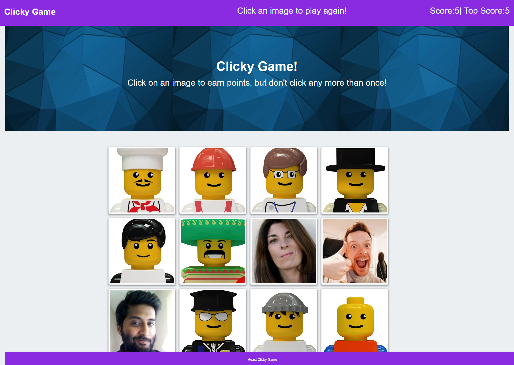

# React Clicky Game

## Overview

This is a memory game built with React. I have broken down the application's UI into components. The app manages component state, and responds to user events.

### How it works

1. The application renders different Lego images to the screen. Each image listens for click events.

2. The application keeps track of the user's score. The user's score is incremented when they click an image for the first time. The user's score is reset to 0 if they click the same image more than once.

3. Every time an image is clicked, the images rendered to the page shuffle themselves in a random order.

5. Once the user's score is reset after an incorrect guess, the game restarts.

### Screenshots

## Demo
The demo of the application can be found [here](https://arcane-woodland-70656.herokuapp.com/).

